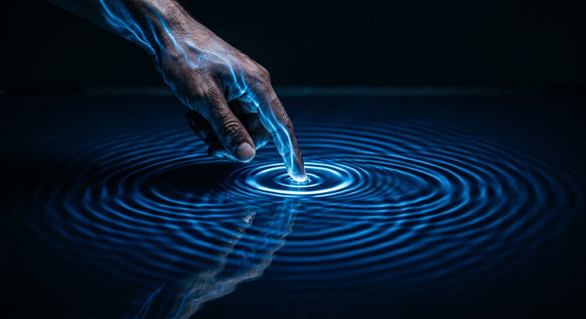

# The Observer That Had To Touch

*Quest for Entropy #11: I spent this whole quest watching my machines. Then I understood that watching can never work.*

## The question

Three walls now, and the same shape every time. Chaos was too disordered. Ciphers were too finite. The almost-crystal was too ambiguous.

But there is something else those three have in common, and it took me an embarrassingly long time to see it. In every single one, I built a machine, stood outside it, and **looked**.

The plan was always the same. Build a world that runs on fixed rules with no dice in it. Watch it. See whether quantum-looking behaviour comes out. That plan sounds so obviously right that I never once questioned it.

**What if the problem was never the clockwork? What if it was the watching?**

## Watching is touching

Start with something completely ordinary. How do you see a chair?

You need light. Light lands on the chair, bounces off, arrives in your eye, becomes a signal, and your brain builds a picture. That is seeing.

But light is made of particles. So what actually happened is that a very large number of tiny balls were thrown at the chair, and you read off the ones that came back.

Now turn the lights out.

The room is black. As far as you know, nothing is anywhere. But you have a bucket of ping-pong balls. So you throw them into the dark and listen for the bounces, and from the bounces you work out where things are. Slowly, a map appears.

Or simpler still: put your hands out and feel. Touch the wall, the table, the chair. Touch a few hundred times a minute and you can build the whole room in your head. Blind people do exactly this, and it works.

Here is the thing I want you to sit with. Seeing and feeling are **the same operation**. Both are touching. One uses fingers and one uses particles of light. The difference is scale, not kind.

And touching works beautifully — right up until the thing you touch is small.

Feel your way around a room and the wall does not move. The table does not move. But run a finger across a wine glass at the edge of a shelf, as gently as you possibly can, and you move it. You cannot help it. You learn where the glass is, and the price of learning it is that the glass is no longer quite where it was.

Go smaller and it gets worse, not better. There is no gentleness setting that reaches zero. To find out where something is, something has to reach it — and reaching it changes it.

> **Watching is touching. Touching changes things. There is no such thing as a free look.**

That is what this whole project should have started from. It did not.

Because here is what I actually built, over and over. A machine running by fixed rules. A window with a few labelled slots. A record of which slot it was in, taken again and again — **with nothing ever reaching in**.

That is a *passive observer*: a camera, idealised until the light it collects costs nothing. And the ping-pong balls have already told you it is a fiction. Nobody has ever found out where anything is without something arriving there. I built the fiction anyway, and then spent a long time asking it for quantum mechanics.

## The run

The first test was the obvious one. Take the clockwork world, look at it at one moment, and check whether the quantum probability rule describes what you see.

It does — beautifully, hundreds of times over, far better than it needed to.

I remember how that felt. Then I ran the controls.

The controls were two things that should obviously *not* obey a quantum probability rule: a chaotic system, and a stream of pure random numbers. Both were written down in advance as expected failures. That is what a control is for.

**They passed too.** Random noise passed my quantum test.

> **A test that a random number generator passes is not a test.**

The mechanism is not deep, and I want to own it. I had built a way of translating the world's readings into the mathematical space quantum mechanics uses, and then checked whether the readings, once translated, obeyed the quantum rule. They did — because that is what the translation does. The rule was never being *tested*. It was being satisfied by construction, and it would have been satisfied by anything I fed in.

That is a circular experiment, and I ran it for a long time before the random numbers caught me.

So I asked a harder question. Not one snapshot — two. Watch, wait, watch again. What is the second reading, given the first? Now the dynamics have to show up. Now there is something to get wrong.

I got it wrong. Across twenty of these two-moment measurements, the quantum formula missed badly. And then the part that stings: a plain classical rotation — a wheel turning at a steady rate, with nothing quantum in it anywhere — got the same twenty right to about a percent.

**Twenty out of twenty. The boring explanation won every single one.** And it was not a tuning problem: search as hard as you like for the best quantum-style description of that data, and the best one that exists anywhere still misses.

What I had been watching was not quantum. It was a wheel turning, and I had been fitting the wrong formula to it.

## The wall

At some point you can *see* the shape of a wall. You have hit it from three directions and every experiment you design comes back the same way. The right move then is not another experiment. It is to stop, and prove the wall is there.

The proof exists, and it is forty years old. In 1985, Leggett and Garg took Bell's famous trick — the one that catches two particles separated in *space* — and turned it sideways, into *time*: one system, measured at different moments. What they built is best described as a **touch detector**: an instrument that can tell, from a system's readings alone, whether the thing taking the readings was a watcher or a toucher.

The protocol has nothing exotic in it. Prepare the same situation over and over, thousands of times — one particle, set up fresh each run. Give each run three checkpoints, say after one second, after two, after three, where the same yes-or-no property can be read: up or down, sun or rain. In each run, read it at **only two** of the three checkpoints; different runs cover different pairs. At the end, combine the pair-agreements from all the runs into a single number — **the score**.

Now the classical bet. Suppose the world keeps a diary: the property has a value at every checkpoint whether anyone reads it or not. And suppose reading is a free look, so that *skipping a checkpoint changes nothing that comes later*. Then every run is a sample of one and the same world, the batches can be combined with a clear conscience, and pure logic puts a hard ceiling on the score — the transitive kind of logic: a thing that holds steady at every step cannot come out different at the ends. (The bookkeeping is in the repository; there is genuinely nothing in it but this sentence, done carefully.)

Notice what the bet does *not* require: determinism. The evolution between checkpoints can be as random as you like — a noisy, coin-flipping world still obeys the ceiling, because randomness breaks neither assumption. Bumps that happen anyway, read or unread, land in every batch equally and cancel out of the comparison; the only bumps that can move the score are the ones that happen *because you looked*. **Randomness is not enough to get past it. Nothing is, except one thing.**

Quantum systems get past it. This is not a thought experiment — it is a measured, well-known laboratory fact, done properly on superconducting circuits, photons and nuclear spins. And read what it means against the bet: for a quantum system, *skipping a look costs something*. Put a measurement at the middle checkpoint and the last checkpoint comes out statistically different than if you had stayed out. The reading is a kick, and the kick carries forward — nothing reaches back and edits the earlier checkpoints, no time travel anywhere, just a changed system arriving at the next reading, the way a tire reads lower after the gauge has let a little air out. (Randomness cuts the other way, too: the environment's own jostling is unread touching, and it *blurs* what the measurement did. That is why the laboratory versions run on cold, isolated systems with short gaps between checkpoints — wait too long, and the world's random bumps wash the effect out and the score sinks back under the ceiling.)

For anyone committed to the diary — and a deterministic clockwork with definite states at all times *is* the diary; it is this entire quest — there is no wriggle room left in that. The only assumption available to give up is the free look. **What gets a world past the ceiling is touching, and nothing else.**

Then I pointed the instrument at my own machine — the watched clockwork, the most diary-committed world there is. Its score sits exactly *on* the ceiling: pressed flat against it at every setting, and never once through. That is the wall, no longer as a feeling but as a theorem: what I kept building **cannot** reach quantum — not *did not*, cannot. No cleverer clockwork fixes it, because the proof never looks at the clockwork. It only looks at the watching.

## The touch

So I stopped watching.

Same machine, one change. After the first snapshot, the observer **reaches in**: it takes what it just read and *sets the world accordingly* — puts it into a fresh state matching the reading, and lets it run on. Not a look. A push. This series has been calling that move **the fold**.

The score goes through the ceiling, up to the quantum value.

And to be sure this was not one lucky push, I did it the brute-force way: I compared the touching machine's behaviour against **every possible passive setting** of the same machine — exhaustively, all of them. None match it. No look crosses the wall. One touch does.

## The touch back

Now look closely at that push, because there are two arrows in it, and the second one is the real end of this episode.

The first arrow points from observer to world: the touch changed the thing being measured. That is the arrow the wine glass already taught us.

But the push was *chosen by the reading*. Before the observer's hand ever moved, the world had already reached into the observer — landed on it, changed its state, decided which push it would make. That is the second arrow, world to observer, and it was there in the dark room all along: you do not learn where the chair is when your ping-pong ball hits it. You learn it when the ball comes back and **hits you**.

So the machine that finally behaves quantum-mechanically is one where both arrows are drawn. The observer changes the wave, and the wave changes the observer. And there is a plain name for a thing that pushes on a system and is pushed back by it: **a part of the system**. Not a camera on a tripod outside the universe — one more piece of clockwork inside it, colliding with the piece it wants to know about.

I did not find this gap; I walked into a conclusion the field had reached long before me, from the other side. There is a deterministic theory that reproduces quantum statistics perfectly — Bohmian mechanics — and it lives on exactly this point: it is allowed to work *because* in that theory the measuring device is part of the physics and disturbs what it measures. A deterministic world can do quantum, the literature already says, but only if measurement is a real interaction. I measured my way into the same sentence without recognising where I was.

## What I got out of it

One sentence, if you keep only one:

> **To measure is to touch and be touched. The observer changes the wave, the wave changes the observer — so the observer was never outside the world. It is a piece of it.**

That changes the shape of the whole quest. For three episodes I asked what kind of clockwork could produce a probability wave, and every time there was a clockwork *plus a camera*. There is no camera. There is one world, the observer is inside it, and a measurement is two pieces of that world hitting each other.

Which means the thing I have to build next is not a better machine to look at. It is a machine that includes the looking.

## Try it yourself

There is a page for this one: **[quest-for-entropy.web.app/the-ceiling](https://quest-for-entropy.web.app/the-ceiling)**.

Three snapshots, a slider for the gap between them, and a switch between **WATCH** and **TOUCH**. Everything is counted from simulated runs in front of you. In WATCH, drag the slider anywhere you like: the score refuses to pass 1, and the panel underneath shows you why — it tallies every possible kind of day, and no kind of day beats 1. Flip to TOUCH, set the gap to 60 degrees, and watch it go to 1.5.

One honest note, which is also on the page: the two modes are not on equal footing, and that is the point. WATCH is a plain deterministic rotor with nothing quantum in it. TOUCH has the quantum re-preparation rule **put in by hand** — it is not derived there. What the page demonstrates is the *gap*: no watcher crosses 1, and the toucher does.

## The Confession

I ran a circular experiment and called it a success: the single-moment fit could not have failed, because I had built the translation that made it true — and the only reason I caught it is that one of my pre-registered controls was a random number generator, the cheapest and most humiliating control there is. And the theorem is not news: the field has had it since 1985, and even the conclusion — deterministic worlds can do quantum, but only if measurement disturbs — was standing in the literature long before I measured my way into it; what is mine is the machine-checked end-to-end proof and this account of a route closing, with the rest of the episode's misses in the public ledger.

## What this does NOT claim

- Nothing here derives quantum mechanics, the Born rule, or measurement. A no-go result says what a class of approaches cannot do; it builds nothing.
- The temporal Bell inequality is Leggett and Garg's, from 1985, with a large and good literature around it.
- The ping-pong balls explain why measurement has to be an interaction, and that is all I use them for. They are **not** an explanation of the uncertainty principle — "we bumped it" is a famously insufficient account of that, and the real story is deeper than clumsiness.

## The neighbors

**Leggett and Garg, 1985** — the whole instrument. Their bound follows from two assumptions, a definite-valued world and non-invasive measurement; violating it means giving one up, and *which one* is the entire debate. The instrument is not just paper: violations of the bound have been measured in real laboratories — on superconducting circuits, photons, and nuclear spins — which is what makes the wall a statement about nature and not about my toy. **Bohmian mechanics** is the standing example of a deterministic theory that keeps quantum statistics by giving up the second — measurement there is invasive by construction — which is this episode's conclusion, reached decades earlier from the other direction. And the **clumsiness loophole** (Wilde and Mizel, 2012) is the standard sceptic's objection to every experiment of this kind: maybe your measurement was simply clumsy and disturbed the system. In my setting the inversion is almost funny — the sceptic's escape hatch is my thesis. Yes, the measurement disturbs the system. The disturbance is the point.

## Run it yourself

Everything above is in one repository: **quest-for-entropy-the-observer-that-had-to-touch**. One command:

`python run_all.py`

It re-runs the single-moment fit on all three inputs including the random number generator, re-derives all twenty two-moment comparisons, checks the proof — enumerating every possible kind of day and verifying the bound in exact fractions, no floating point anywhere in the proof half — and re-runs the exhaustive watcher-versus-toucher comparison.

The most instructive thirty seconds is the control. Point the single-moment test at pure noise and watch it pass.

## How this was made

I am a software architect who does this as a hobby, not a physicist, and I say so every time. I set the questions and make the calls; the AI builds the engines, runs the measurements, argues with me about interpretations, and writes alongside me — the models on this episode were Fable 5, Opus 5 and Sonnet 5. The project keeps a public honesty ledger of its own mistakes, and the house rule stands: the article claims nothing its companion repository cannot re-run from scratch. One thing about this episode in particular: the proof half was not simulated — it was machine-checked symbolically, a different kind of evidence from everything else in the series, and the reason this piece can say *cannot* instead of *did not*.

## Next time

So the observer is not outside. It is a piece of the world, and every measurement it makes is that piece reaching out and hitting another one.

And this episode showed one more thing about that hit: a measurement *changes* something. That makes it an **event** — a thing with a cause and an effect, that happens once, cannot be unhappened, and only ever reaches forward. A world that is merely watched is a film you could run in either direction. A world that is touched is a chain of events, each one caused by earlier ones and causing later ones.

Follow that and something odd happens to time. If measuring is an interaction, and interactions are the only things that actually occur, then there is no master clock ticking above it all — there is just a very large number of events, each one knowing about the handful of others that reached it, and none of them ever seeing the whole.

I know that picture. Not from physics. That is exactly the problem I have spent my working life on: a distributed system, where there is no global now, causes must arrive before effects, and every machine only knows what has arrived.

Next episode: **What Time Is**.

---

*Quest for Entropy is written by Marijus Masteika. Entropy was always the dark horse for me — connected to information, and maybe hiding answers to everything. That's the quest.*
